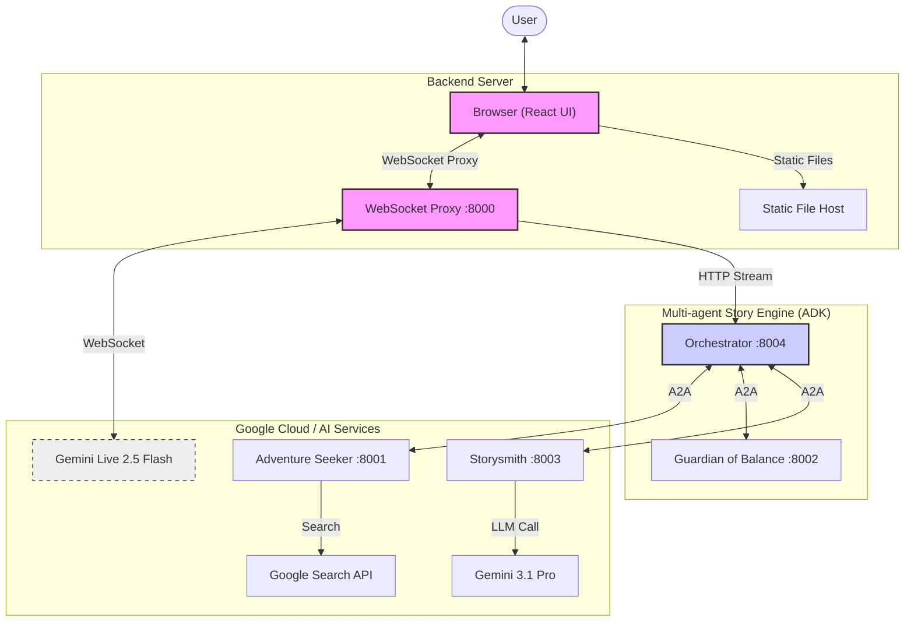
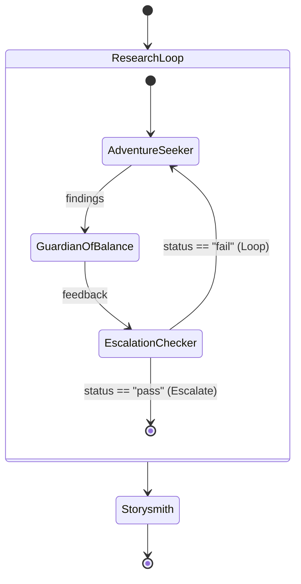
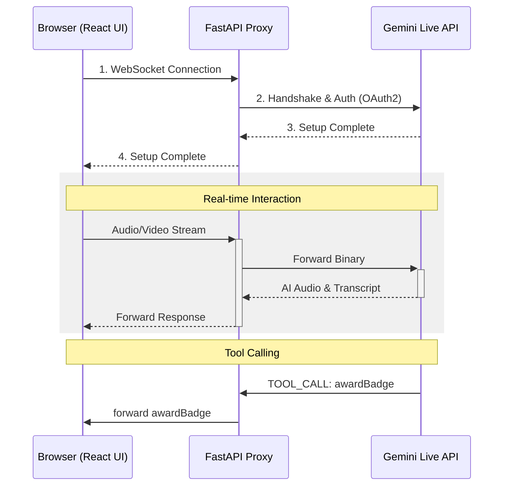
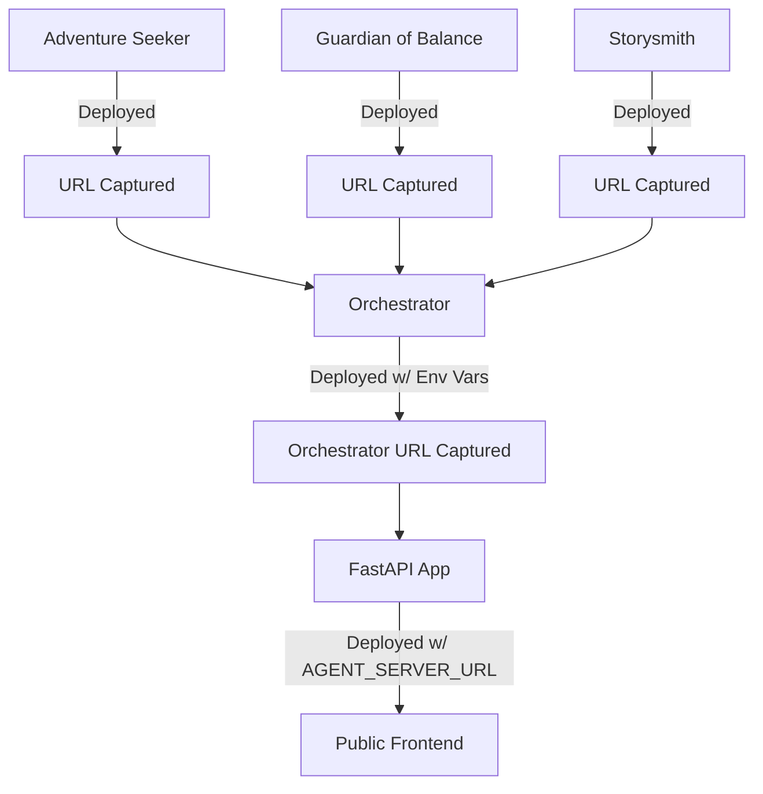

# 🏗️ Architecture — Gemini Tales

> Deep-dive into the system design, component responsibilities, data flows, and key design decisions.

---

## Table of Contents

1. [High-level Overview](#1-high-level-overview)
2. [Storytelling Modes](#2-storytelling-modes)
3. [Repository Layout](#3-repository-layout)
4. [Subsystem A — Dynamic Interaction (Frontend)](#4-subsystem-a--dynamic-interaction-frontend)
5. [Subsystem B — Multi-agent Story Engine (Backend)](#5-subsystem-b--multi-agent-story-engine-backend)
6. [Subsystem C — Character Workshop](#6-subsystem-c--character-workshop)
7. [Data Flows](#7-data-flows)
8. [Service Topology & Ports](#8-service-topology--ports)
9. [Deployment](#9-deployment)
10. [Key Design Decisions](#10-key-design-decisions)
11. [Tech Stack Summary](#11-tech-stack-summary)

---

## 1. High-level Overview

Gemini Tales is an integrated AI storytelling system built on the Google Agent Development Kit (ADK). It allows users to generate interactive stories through two distinct pathways: **Live** and **Agent-driven**.

| Component | Responsibility | Primary Technology |
|---|---|---|
| **Frontend** | Modern UI for mode selection and interactive storytelling | React / Vite / Tailwind CSS |
| **API Layer** | WebSocket Proxy & Static File Host | Python / FastAPI / Uvicorn |
| **Story Engine** | Multi-agent pipeline for research and writing | Google ADK / A2A Protocol |



---

## 2. Storytelling Modes

Gemini Tales now supports two core experiences, toggled via the UI.

### 2.1 Live Mode (Spontaneous)
In **Live Mode**, the system uses the native `Gemini Live` capabilities for an unscripted, highly interactive session. 
- **Latency**: Near-zero.
- **Narrative**: Emerges directly from the child's input.
- **Visuals**: Triggered by tool-calls during the live conversation.

### 2.2 Agent Mode (Structured)
In **Agent Mode**, the multi-agent backend pre-generates a story foundation before the live session begins.
1. **Research**: Adventure Seeker scouts facts/legends.
2. **Review**: Guardian of Balance ensures safety and physical activity density.
3. **Writing**: Storysmith weaves a Markdown-based epic.
4. **Narration**: The pre-generated text is injected into the Gemini Live session, where Puck (the AI avatar) narrates it with expressive character voices.

---

## 3. Repository Layout

```
gemini-tales/
├── app/                        # Main FastAPI Server & Frontend
│   ├── main.py                 # WebSocket Proxy & Static Site Host
│   ├── frontend/               # React Frontend (TypeScript)
│   │   ├── src/                # TSX/TS components and logic
│   │   ├── dist/               # Production build
│   │   └── package.json        # Node.js dependencies (React 19)
│
├── agents/                     # ADK Agents (microservices)
│   ├── researcher/             # Adventure Seeker
│   ├── judge/                  # Guardian of Balance
│   ├── content_builder/        # Storysmith
│   └── orchestrator/           # Pipeline logic
│
├── shared/                     # Shared utilities for agents
│   ├── adk_app.py              # Common A2A server entry point
│   └── config.py               # Shared Gemini config (Safety settings)
│
├── assets/                     # UI Assets & Documentation images
├── pyproject.toml              # Root workspace manifest (uv)
├── run_local.ps1               # Starts all 5 services locally (uv)
└── deploy.ps1                  # Deploys all 5 services to Cloud Run
```

---

## 4. Subsystem A — Interactive Story UI (Frontend)

The frontend is a high-performance web interface migrated to **TypeScript** for enhanced stability. It orchestrates a unified multimodal stream.

### 3.1 Multimodal Pipeline (Voice + Vision)

Unlike traditional chatbots, Gemini Tales uses a synchronized stream:
- **Unified Session**: A single WebSocket session handles both **PCM Audio** (captured via `AudioWorklet`) and **Video Frames** (1 FPS JPEG/Base64).
- **Spatial/Visual Context**: Gemini processes video frames in real-time, allowing it to comment on physical actions or surroundings during the audio story.

### 3.2 Auto-start Logic

To minimize friction, the application implements an automatic story trigger:
1. **Handshake**: Browser establishes `ws://` connection via the FastAPI proxy.
2. **Agent Sync**: Upon `SETUP_COMPLETE`, the frontend calls the `/api/chat_stream` endpoint.
3. **Pre-story Research**: The **Orchestrator** triggers the agent network (Researcher -> Judge -> Storysmith) to generate a structured story context based on search and safety rules.
4. **Context Injection**: The resulting story is injected into the Gemini Live session as a background "memory" trigger.
5. **Immersive Entry**: The AI begins the narrative based on the agent-generated plot, greeting the user with voice and an initial illustration.

### 3.4 Interactive Gameplay (Visual Feedback Loop)

The application implements a unique "Stop-and-Watch" mechanism:
- **Challenge Trigger**: The system instructions guide Gemini to ask for a physical action.
- **Immediate Silence**: The model is instructed to stop speaking and wait after the request.
- **Multimodal Verification**: Using the 1 FPS video feed and audio transcription, the "Live" model detects when the child has completed the action and said the magic word, then resumes the story with praise.

### 3.3 Media & Device Management

The UI includes a robust device initialization flow (`fetchDevices`) that handles permissions and allows users to swap microphones/cameras on-the-fly without breaking the live session.

---

## 5. Subsystem B — Multi-agent Story Engine (Backend)

### 4.1 Agent Roles

| Agent | Model | Key tools / output | ADK type |
|---|---|---|---|
| **Adventure Seeker** | `gemini-3.1-flash-lite` | `google_search` | `Agent` |
| **Guardian of Balance** | `gemini-3.1-flash-lite` | Safety/Quality Evaluation | `Agent` |
| **Storysmith** | `gemini-3.1-pro` | High-fidelity narrative | `Agent` |
| **Orchestrator** | — | A2A Coordination | `SequentialAgent` |

### 4.2 Orchestration Logic



**EscalationChecker** is a custom `BaseAgent` subclass. It reads `session.state["judge_feedback"]` and yields an `Event(escalate=True)` to break the `LoopAgent`, or an empty event to continue.

### 4.3 A2A Communication

Each of the three leaf agents (Researcher, Judge, Content Builder) runs as a standalone **A2A server** (served by `adk_app.py`). The Orchestrator connects to them via `RemoteA2aAgent`, which:

1. Reads the agent card from `<agent_url>/.well-known/agent-card.json`
2. Posts tasks over HTTP using the A2A protocol
3. Uses an **authenticated HTTPX client** (`authenticated_httpx.py`) to attach Google OAuth2 bearer tokens automatically — required when deployed on Cloud Run

```
Orchestrator
  ├── RemoteA2aAgent("researcher")  → HTTP POST  http://localhost:8001/a2a/... (Adventure Seeker)
  ├── RemoteA2aAgent("judge")       → HTTP POST  http://localhost:8002/a2a/... (Guardian of Balance)
  └── RemoteA2aAgent("content_builder") → HTTP POST  http://localhost:8003/a2a/... (Storysmith)
```

### 4.4 FastAPI Proxy Layer

`app/main.py` serves two critical functions:

1. **Static File Hosting**: Serves the compiled React frontend from the `dist/` directory.
2. **Gemini Live WebSocket Proxy**: Exposes a `/ws/proxy` endpoint that handles the complex handshake and authentication with the Google Cloud Vertex AI endpoint.

**Proxy Workflow:**
1. Browser connects to `ws://localhost:8000/ws/proxy?project=...&model=...`.
2. FastAPI backend generates a fresh **Google OAuth2 bearer token**.
3. It establishes a secure WebSocket connection to the **LlmBidiService** in `us-central1`.
4. It bi-directionally pipes messages between the browser and Google, handling binary audio data and JSON tool calls transparently.

---

## 6. Subsystem C — Character Workshop

The **Character Workshop** is a dedicated module for creating consistent character visuals that persist across story scenes, powered by **Gemini 2.5 Flash-Image**.

### 6.1 Multi-turn Consistency Logic

To solve the "same face" problem common in AI generation, we use a stateful chat session:
1. **Initial Portrait**: The user provides a text description (e.g., "girl with red pigtails"). Gemini generates a base watercolor portrait.
2. **Session Persistence**: The `StoryAvatarGenerator` maintains an active `ChatSession` with the model.
3. **Action Mapping**: When the user requests an action (e.g., "casting a spell"), the specific instruction is sent *inside* the same chat session.
4. **Contextual Awareness**: Because the model "remembers" its previous output (the portrait), it maintains the child's likeness, hair, and clothing in the new action pose.

### 6.2 Photo-to-Avatar Transformation

The system supports a multimodal "likeness transfer" flow:
- **Input**: A real photo (JPEG/PNG) and a fairytale style prompt.
- **Multimodal Prompt**: The backend sends both the image bytes and the prompt to the multimodal model.
- **Stylization**: Gemini analyzes the facial features (glasses, smile, face shape) and "repaints" them into the whimsical watercolor aesthetic while preserving the user's likeness.

---

## 7. Data Flows

### 5.1 Real-time Storytelling Flow (WebSocket)



### 5.2 Multi-agent Research Flow

The ADK agents are still utilized by the `content_builder` during specific story transitions or for pre-generating lore, following the same A2A orchestration described in Subsystem B.

---

## 8. Service Topology & Ports

| Service | Port | Technology | Start command |
|---|---|---|---|
| **App** (Frontend + Proxy) | `8000` | FastAPI + React (dist) | `uvicorn main:app` |
| **Adventure Seeker** | `8001` | ADK A2A server | `adk_app.py --a2a` |
| **Guardian of Balance**| `8002` | ADK A2A server | `adk_app.py --a2a` |
| **Storysmith** | `8003` | ADK A2A server | `adk_app.py --a2a` |
| **Orchestrator** | `8004` | ADK server | `adk_app.py` |

All services are started in the correct order by `run_local.ps1`. A 5-second sleep ensures leaf agents are ready before the orchestrator tries to resolve their agent cards.

---

## 9. Deployment

All five services are containerised with individual `Dockerfile`s and deployed to **Google Cloud Run** via `deploy.ps1`.

**Deployment order** (enforced by the script):

1. Adventure Seeker → deployed, URL captured
2. Guardian of Balance → deployed, URL captured
3. Storysmith → deployed, URL captured
4. Orchestrator → deployed (receives agent URLs as env vars), URL captured
5. App → deployed (receives orchestrator URL as `AGENT_SERVER_URL`)



The `course-creator` (App) Cloud Run service is publicly accessible. The four agent services have `--no-allow-unauthenticated` and require a Google OAuth2 bearer token — handled transparently by `authenticated_httpx.py` using Application Default Credentials.

**Observability:** The FastAPI app instruments traces with **OpenTelemetry** and exports them to **Google Cloud Trace** via `CloudTraceSpanExporter`.

---

## 10. Key Design Decisions

### Proxied WebSocket Communication
Instead of calling the Gemini Live API directly from the browser, we use a FastAPI WebSocket proxy. This ensures that the **Vertex AI credentials** and **Project ID** remain secure on the server, while still providing a low-latency pipe for audio and video data.

### React + Vite Single Page Application (SPA)
The front end was migrated from Vanilla JS to a React SPA. This allows for more robust state management of the complex real-time media streams and tool calls, as well as a more responsive and premium UI.

### Pre-story Agent Contextualization
To provide high-quality and safe content, we separated story *generation* from story *delivery*. The ADK agent network performs research and safety checks asynchronously before the live conversation starts, ensuring the "Live" AI has a solid, well-researched narrative foundation.

### LoopAgent with EscalationChecker
Rather than using a fixed number of research passes, the Judge's `output_schema` produces a structured `{ status: "pass"|"fail" }` verdict. The `EscalationChecker` reads this from session state and escalates the loop early when quality is sufficient (up to a safety cap of 3 iterations).

### A2A over direct agent calls
Using the A2A protocol means each agent is independently deployable and scalable. The Orchestrator only needs to know the agent card URL — not the implementation. This also enables mixing agents written in different languages or frameworks in the future.

### Session state as the shared-memory bus
The Orchestrator saves agent outputs (`research_findings`, `judge_feedback`) into ADK **session state**. Sub-agents read from this state in their prompts via the `{state[key]}` template syntax. This avoids passing large payloads through function arguments and keeps the inter-agent contract simple.

### Authenticated HTTPX client
`authenticated_httpx.py` wraps `google.auth.transport.requests` to inject an OAuth2 bearer token into every outgoing request. The same helper is used both by the Orchestrator (to call leaf agents) and by the FastAPI app (to call the Orchestrator). In local development, tokens are sourced from `gcloud auth application-default login`.

---

## 11. Tech Stack Summary

| Layer | Technology | Version |
|---|---|---|
| Large Language Model | Gemini 3.1 Flash-Lite / Pro | (Default: `3.1-flash-lite`) |
| Live Interaction | Gemini Live 2.5 Flash | — |
| Multi-agent framework | Google Agent Development Kit (ADK) | `1.22.0` |
| Frontend | React + Vite + Tailwind CSS | — |
| Backend | FastAPI + Uvicorn | `0.123.*` |
| Protocol | WebSocket / A2A | — |
| Python | CPython | `≥ 3.10` |
| Package manager | uv | — |
| Hosting | Google Cloud Run | — |
