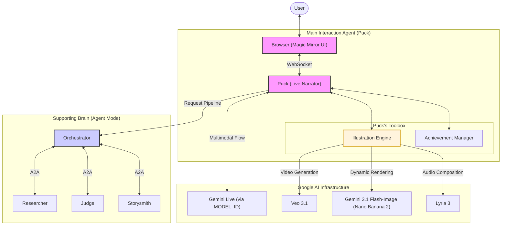
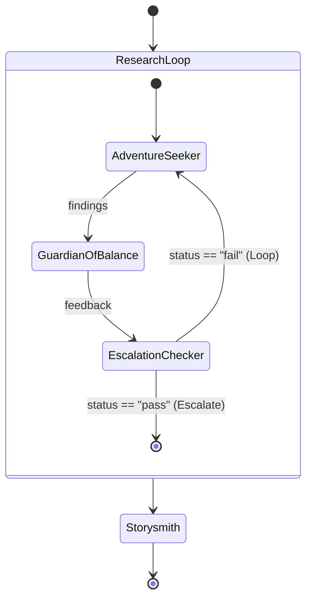
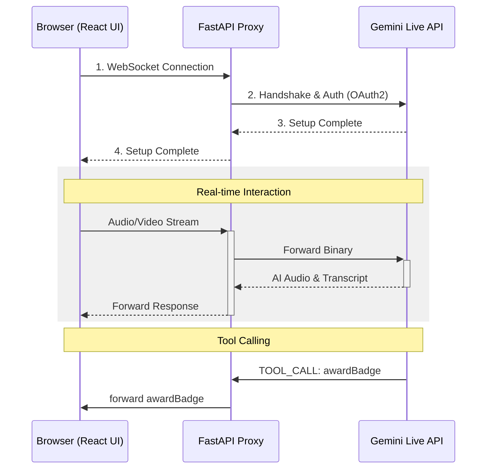
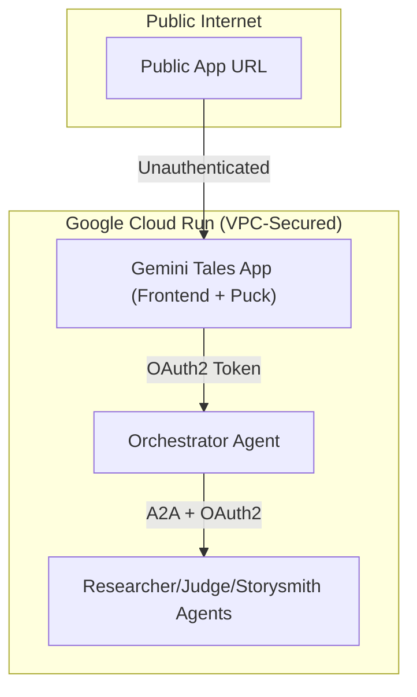

# 🏗️ Architecture — Gemini Tales

> Deep-dive into the system design, component responsibilities, data flows, and key design decisions.

---

## Table of Contents

1. [High-level Overview](#1-high-level-overview)
2. [Storytelling Modes](#2-storytelling-modes)
3. [Repository Layout](#3-repository-layout)
4. [Subsystem A — Dynamic Interaction (Frontend)](#4-subsystem-a--dynamic-interaction-frontend)
5. [Subsystem B — Multi-agent Story Engine (Backend)](#5-subsystem-b--multi-agent-story-engine-backend)
6. [Subsystem C — Character Workshop](#6-subsystem-c--character-workshop)
7. [User Journey & Core Workflows](#7-user-journey--core-workflows)
8. [Data Flows](#8-data-flows)
9. [Service Topology & Ports](#9-service-topology--ports)
10. [Deployment](#10-deployment)
11. [Key Design Decisions](#11-key-design-decisions)
12. [Tech Stack Summary](#12-tech-stack-summary)

---

Gemini Tales is an integrated AI storytelling system built on the Google Agent Development Kit (ADK). It allows users to generate interactive stories through two distinct pathways: **Live** and **Agent-driven**, acting as a **Creative Storyteller ✍️** that breaks the traditional "text box" paradigm.

| Component | Responsibility | Primary Technology |
|---|---|---|
| **Frontend** | "Magic Mirror" UI — Real-time interaction & media | React 19 / Vite / Tailwind |
| **Main Agent (Puck)** | Live Narrator — Handles voice, vision, and interleaved media | Python / FastAPI / `gemini-2.5-flash-native-audio-preview-12-2025` (via `MODEL_ID` in `.env`) |
| **Supporting Brain** | Background agents for research, safety, and writing | Google ADK / A2A Protocol |
| **Media Factory** | Generates cinematic animations, illustrations, and music | Veo 3.1 / Gemini 3.1 Flash-Image (Nano Banana 2) / Lyria 3 |


```mermaid
graph TD
    User([User]) <--> Browser["Browser (Magic Mirror UI)"]
    
    subgraph "Main Interaction Agent (Puck)"
        Browser <-->|WebSocket| Puck["Puck (Live Narrator)"]
        subgraph "Puck's Toolbox"
            Illustrator["Illustration Engine"]
            Awards["Achievement Manager"]
        end
        Puck <--> Illustrator
        Puck <--> Awards
    end
    
    subgraph "Google AI Infrastructure"
        Puck <-->|Multimodal Flow| GeminiLive["Gemini Live (via MODEL_ID)"]
        Illustrator -->|Video Generation| Veo[Veo 3.1]
        Illustrator -->|Dynamic Rendering| FlashImage["Gemini 3.1 Flash-Image (Nano Banana 2)"]
        Illustrator -->|Audio Composition| Lyria3[Lyria 3]
    end
    
    subgraph "Supporting Brain (Agent Mode)"
        Puck -->|Request Pipeline| Orchestrator[Orchestrator]
        Orchestrator <-->|A2A| Researcher[Researcher]
        Orchestrator <-->|A2A| Judge[Judge]
        Orchestrator <-->|A2A| Storysmith[Storysmith]
    end
    
    style Browser fill:#f9f,stroke:#333,stroke-width:2px
    style Puck fill:#f9f,stroke:#333,stroke-width:2px
    style Orchestrator fill:#ccf,stroke:#333,stroke-width:2px
    style Illustrator fill:#fff4dd,stroke:#d4a017,stroke-width:2px
```

---

## 2. Storytelling Modes

Gemini Tales now supports two core experiences, toggled via the UI.

### 2.1 Live Mode (Spontaneous / Лайв-режим)
In **Live Mode**, the system uses the native `Gemini Live` capabilities for an unscripted, highly interactive session:
- **Initiation**: The user clicks **Connect API**, which opens a WebSocket connection using the query parameter `?mode=live` (e.g. `ws://localhost:8000/ws/puck_live/.../?mode=live`).
- **Backend Behavior**: The backend immediately activates the voice agent, which is ready for spontaneous, free-form dialog (the "Improviser").
- **Latency**: Near-zero.
- **Visuals**: Triggered by tool-calls during the live conversation.

### 2.2 Agent Mode (Structured / Агентный режим)
In **Agent Mode**, the multi-agent backend pre-generates a story foundation before the live session begins:
- **Story Generation**: The frontend makes a request to the background ADK agent network (Researcher -> Judge -> Storysmith) to draft the story.
- **Transition**: Once the scenario/script is ready, the action button transitions to **"Wake Puck!" (Разбудить Пака)**.
- **Initiation**: Clicking this button opens a WebSocket connection with the query parameter `?mode=agent` (e.g. `ws://localhost:8000/ws/puck_live/.../?mode=agent`). The frontend then automatically hands over the drafted story blueprint to the Live session.
- **Backend Behavior**: Puck reads the story blueprint and strictly follows the prepared plot, narrating this exact pre-planned story to the child step-by-step.

---

## 3. Repository Layout

```
gemini-tales/
├── frontend/                   # "Magic Mirror" React 19 Frontend
│   ├── src/                    # TSX components (Gemini Live integration)
│   └── package.json            # Node.js dependencies
│
├── backend/
│   ├── app/                    # Main Agent (Puck) & Media Factory
│   │   ├── main.py             # FastAPI WebSocket Entry Point
│   │   ├── avatar_generator.py # Composite Image + Audio generator
│   │   ├── services/           # Granular Media Logic
│   │   │   ├── music_generator.py # Lyria 3 Music Composition
│   │   │   └── ...
│   │   └── routers/            # Puck Live & Agent Story Endpoints
│   │
│   └── agents/                 # Supporting ADK Brain
│       ├── researcher/         # Adventure Seeker (Search)
│       ├── judge/              # Guardian of Balance (Safety/Movement)
│       ├── content_builder/    # Storysmith (Narrative)
│       ├── orchestrator/       # Pipeline coordination
│       ├── shared/             # Shared Safety & Config
│       ├── run_local.ps1       # Local start for Brain microservices
│       └── deploy.ps1          # Cloud Run deployment script
```

Note: `backend/agents/orchestrator/_last_trace.json` is a generated debug trace of the last pipeline run, used by the trace modal. It is excluded from version control via `.gitignore`.


---

## 4. Subsystem A — Interactive Story UI (Frontend)

The frontend is a high-performance web interface migrated to **TypeScript** for enhanced stability. It orchestrates a unified multimodal stream.

### 4.1 Multimodal Pipeline (Voice + Vision)

Unlike traditional chatbots, Gemini Tales uses a synchronized stream:
- **Unified Session**: A single WebSocket session handles both **PCM Audio** (captured via `AudioWorklet`) and **Video Frames** (1 FPS JPEG/Base64).
- **Spatial/Visual Context**: Gemini processes video frames in real-time, allowing it to comment on physical actions or surroundings during the audio story.

### 4.2 Auto-start Logic

To minimize friction, the application implements an automatic story trigger:
1. **Handshake**: Browser establishes `ws://` connection via the FastAPI proxy.
2. **Agent Sync**: Upon `SETUP_COMPLETE`, the frontend calls the `/api/chat_stream` endpoint.
3. **Pre-story Research**: The **Orchestrator** triggers the agent network (Researcher -> Judge -> Storysmith) to generate a structured story context based on search and safety rules.
4. **Context Injection**: The resulting story is injected into the Gemini Live session as a background "memory" trigger.
5. **Immersive Entry**: The AI begins the narrative based on the agent-generated plot, greeting the user with voice and an initial illustration.

### 4.3 Interactive Gameplay (Visual Feedback Loop)

The application implements a unique "Stop-and-Watch" mechanism:
- **Challenge Trigger**: The system instructions guide Gemini to ask for a physical action.
- **Immediate Silence**: The model is instructed to stop speaking and wait after the request.
- **Multimodal Verification**: Using the 1 FPS video feed and audio transcription, the "Live" model detects when the child has completed the action and said the magic word, then resumes the story with praise.

### 4.4 Media & Device Management

The UI includes a robust device initialization flow (`fetchDevices`) that handles permissions and allows users to swap microphones/cameras on-the-fly without breaking the live session.

---

## 5. Subsystem B — Multi-agent Story Engine (Backend)

### 5.1 Agent Roles

| Agent | Model (Configured in `.env`) | Key tools / output | ADK type |
|---|---|---|---|
| **Adventure Seeker** | `gemini-3.1-flash-lite-preview` (`MODEL_NAME_FLASH`) | `google_search` | `Agent` |
| **Guardian of Balance** | `gemini-3.1-flash-lite-preview` (`MODEL_NAME_FLASH`) | Safety/Quality Evaluation | `Agent` |
| **Storysmith** | `gemini-3.1-pro-preview` (`MODEL_NAME`) | High-fidelity narrative | `Agent` |
| **Orchestrator** | — | A2A Coordination | `SequentialAgent` |

### 5.2 Orchestration Logic


```mermaid
stateDiagram-v2
    [*] --> ResearchLoop
    
    state ResearchLoop {
        [*] --> AdventureSeeker
        AdventureSeeker --> GuardianOfBalance: findings
        GuardianOfBalance --> EscalationChecker: feedback
        
        state EscalationChecker <<choice>>
        EscalationChecker --> [*]: status == "pass" (Escalate)
        EscalationChecker --> AdventureSeeker: status == "fail" (Loop)
    }
    
    ResearchLoop --> Storysmith
    Storysmith --> [*]
```

**EscalationChecker** is a custom `BaseAgent` subclass. It reads `session.state["judge_feedback"]` and yields an `Event(escalate=True)` to break the `LoopAgent`, or an empty event to continue.

### 5.3 A2A Communication

Each of the three leaf agents (Researcher, Judge, Content Builder) runs as a standalone **A2A server** (served by `adk_app.py`). The Orchestrator connects to them via `RemoteA2aAgent`, which:

1. Reads the agent card from `<agent_url>/.well-known/agent-card.json`
2. Posts tasks over HTTP using the A2A protocol
3. Uses an **authenticated HTTPX client** (`authenticated_httpx.py`) to attach Google OAuth2 bearer tokens automatically — required when deployed on Cloud Run

```
Orchestrator
  ├── RemoteA2aAgent("researcher")  → HTTP POST  http://localhost:8001/a2a/... (Adventure Seeker)
  ├── RemoteA2aAgent("judge")       → HTTP POST  http://localhost:8002/a2a/... (Guardian of Balance)
  └── RemoteA2aAgent("content_builder") → HTTP POST  http://localhost:8003/a2a/... (Storysmith)
```

### 5.4 FastAPI Proxy Layer

`app/main.py` serves three critical functions:

1. **Static File Hosting**: Serves the compiled React frontend from the `dist/` directory.
2. **Gemini Live WebSocket Proxy**: Exposes a `/ws/proxy` endpoint that handles the complex handshake and authentication with the Google Cloud Vertex AI endpoint.
3. **Puck Live WebSocket Endpoint**: Mounts `/ws/puck_live/{user_id}/{session_id}` which establishes the ADK session-local runner for the narrator/improviser live session.

**Proxy Workflow:**
1. Browser connects to `ws://localhost:8000/ws/proxy?project=...&model=...`.
2. FastAPI backend generates a fresh **Google OAuth2 bearer token**.
3. It establishes a secure WebSocket connection to the **LlmBidiService** in `us-central1`.
4. It bi-directionally pipes messages between the browser and Google, handling binary audio data and JSON tool calls transparently.

---

## 6. Subsystem C — Media Factory & Character Workshop

The **Media Factory** provides a seamless, context-aware visual layer that makes the story **feel alive**.

### 6.1 Cinematic Animation (Veo 3.1)
- **Technology**: **Veo 3.1** (Google's latest video generation model).
- **Function**: Transforms the static character description into a 4-second magical video preview.
- **Trigger**: Activated by the user via the "Animate" button in the Character Workshop.
- **Technical Detail**: The input reference image is loaded as raw binary data and passed to `generate_videos` as a `types.Image` wrapper containing `image_bytes` and `mime_type` (which serializes to `bytesBase64Encoded` and `mimeType` on the wire, as required by the Veo API).


### 6.2 Interleaved Illustrations (Gemini 3.1 Flash-Image)
- **Technology**: **Gemini 3.1 Flash-Image**.
- **Function**: Automatically generates high-quality watercolor illustrations for every new scene.
- **Mechanism**: The Main Agent (Puck) triggers a `generateIllustration` tool call, which is processed by the backend. The `StoryAvatarGenerator` then orchestrates a multi-model pipeline: first generating a watercolor image, then passing that image to Lyria to compose a matching background track.
- **Movement Loop**: Puck also uses the `recordMovement` tool to update the **Heroic Energy** state when visual confirmation of an exercise is received.

### 6.3 Adaptive Soundtracks (Lyria 3)
- **Technology**: **Lyria 3** (Google's latest music generation family).
- **Function**: Generates 30-second, 48kHz high-fidelity stereo background music.
- **Multimodal Link**: Uses the generated scene illustration as a visual prompt to ensure the music perfectly matches the current story's mood and setting.

### 6.4 Portrait Transformation
The system supports a multimodal "likeness transfer" flow:
- **Input**: A real photo (JPEG/PNG) and a fairytale style prompt.
- **Process**: Gemini analyzes facial features from the upload and "repaints" them in the whimsical watercolor aesthetic, ensuring the child sees themselves as the hero.

---

## 7. User Journey & Core Workflows

Our current system workflow integrates character onboarding and interactive movement tracking:

```
🖼️ Generate img by photo (Nano Banana 2) -> 🎬 Animate Puck (Veo 3.1) -> Puck's Music Theme (Lyria 3) -> Main Screen -> Choose Story Mode -> Choose Exercise Focus -> Connect API -> Settings (Mic, Video) = Connected
```

### 7.1 Onboarding & Customization Flow
1. **Avatar Generation**: The user uploads a photo to the Character Workshop, and **Gemini 3.1 Flash-Image (Nano Banana 2)** generates a customized watercolor fairytale character.
2. **Animation**: Clicking the **Animate** button prompts **Veo 3.1** to generate a 4-second animated video loop of the character.
3. **Soundtrack**: **Lyria 3** composes a custom background theme matching the avatar's style.
4. **Transition**: The user enters the main screen to begin the interactive story.

### 7.2 Movement Analysis & Energy Verification
When the child is asked to perform a physical task, the following flow triggers:
* **Step A: Pass Focus to ADK Agent**: The chosen Exercise Focus (Sky Magic, Earth Magic, or Solar Power) is passed to the backend websocket via the `exercise_mode` query parameter, adjusting Puck's instruction context.
* **Step B: Camera Analysis**: The child's movements are sent as a live video stream (1 FPS) to the backend, where the model analyzes the movements.
* **Step C: Heroic Energy Award**: Once the backend registers movement, it issues a `recordMovement` tool call, awarding a set amount of **Heroic Energy** (e.g., `+15 Energy`).
* **Step D: Visual Effects**: The frontend renders a glowing golden particle effect and plays audio/visual feedback to confirm the completion.

---

## 8. Data Flows

### 8.1 Real-time Storytelling Flow (WebSocket)


```mermaid
sequenceDiagram
    participant B as Browser (React UI)
    participant P as FastAPI Proxy
    participant G as Gemini Live API

    B->>P: 1. WebSocket Connection
    P->>G: 2. Handshake & Auth (OAuth2)
    G-->>P: 3. Setup Complete
    P-->>B: 4. Setup Complete
    
    rect rgb(240, 240, 240)
        Note over B, G: Real-time Interaction
        B->>+P: Audio/Video Stream
        P->>+G: Forward Binary
        G-->>-P: AI Audio & Transcript
        P-->>-B: Forward Response
    end
    
    Note over G, B: Tool Calling
    G->>P: TOOL_CALL: awardBadge
    P->>B: forward awardBadge
```

### 8.2 Multi-agent Research Flow

The ADK agents are still utilized by the `content_builder` during specific story transitions or for pre-generating lore, following the same A2A orchestration described in Subsystem B.

---

## 9. Service Topology & Ports

| Service | Port | Technology | Start command |
|---|---|---|---|
| **App** (Frontend + Proxy) | `8000` | FastAPI + React (dist) | `uv run python app/main.py` |
| **Adventure Seeker** | `8001` | ADK A2A server | `uv run python adk_app.py researcher --host 0.0.0.0 --port 8001 --a2a` |
| **Guardian of Balance**| `8002` | ADK A2A server | `uv run python adk_app.py judge --host 0.0.0.0 --port 8002 --a2a` |
| **Storysmith** | `8003` | ADK A2A server | `uv run python adk_app.py content_builder --host 0.0.0.0 --port 8003 --a2a` |
| **Orchestrator** | `8004` | ADK server | `uv run python adk_app.py orchestrator --host 0.0.0.0 --port 8004 --a2a` |

All services are started in the correct order by `run_local.ps1`. A 5-second sleep ensures leaf agents are ready before the orchestrator tries to resolve their agent cards.

---

## 10. Deployment

The system is designed for a split deployment strategy using two specialized automation scripts. This ensures that the "Supporting Brain" (internal agents) and the "Interaction Head" (Puck + Frontend) are correctly configured and secured.

### 10.1 Two-Stage Automation

1. **Supporting Agents (`backend/agents/deploy.ps1`)**:
   - Deploys Researcher, Judge, Content Builder, and Orchestrator.
   - Enforces `--no-allow-unauthenticated` for internal safety.
   - Orchestrates the capture of service URLs to build the agentic network graph.

2. **Main Application (`deploy_app.ps1`)**:
   - Deploys the unified **Gemini Tales App** (Puck + Frontend).
   - Handles the dual-stage build: compiles the React 19 frontend and wraps it with the FastAPI server.
   - Automatically injects `GOOGLE_CLOUD_PROJECT` and other metadata as environment variables.

### 10.2 Dynamic Configuration Injection

To allow for runtime updates to AI models and parameters without re-compiling the frontend, we use a **Dynamic Config Endpoint**:
- **Backend**: `GET /api/config` reads secrets (like API Keys and Model IDs) from the Cloud Run environment.
- **Frontend**: During initialization, the React app fetches this data to self-configure.
- **Benefit**: Judges can swap models or keys via the Google Cloud console, and the "Magic Mirror" will adapt instantly on the next page refresh.

### 10.3 Service Topology & Security


```mermaid
graph TD
    subgraph "Public Internet"
        UI[Public App URL]
    end
    
    subgraph "Google Cloud Run (VPC-Secured)"
        App["Gemini Tales App (Frontend + Puck)"]
        Orchestrator["Orchestrator Agent"]
        Brain["Researcher/Judge/Storysmith Agents"]
    end
    
    UI -->|Unauthenticated| App
    App -->|OAuth2 Token| Orchestrator
    Orchestrator -->|A2A + OAuth2| Brain
```

The **Gemini Tales App** is the only public entry point. All inter-agent communication is secured with Google OAuth2 bearer tokens, managed by `authenticated_httpx.py`.

**Observability:** The FastAPI app instruments traces with **OpenTelemetry** and exports them to **Google Cloud Trace** via `CloudTraceSpanExporter`.

---

## 11. Key Design Decisions

### Proxied WebSocket Communication
Instead of calling the Gemini Live API directly from the browser, we use a FastAPI WebSocket proxy. This ensures that the **Vertex AI credentials** and **Project ID** remain secure on the server, while still providing a low-latency pipe for audio and video data.
* **ADK Messaging Protocol Alignment**: When running in ADK proxy mode (`useADK = true`), the client wraps text messages in a simplified JSON object (`{ text: ... }`) expected by the ADK `LiveRequestQueue` endpoint (which forwards it to the ADK `LiveRequestQueue`), rather than the raw Gemini Live API JSON structure (`{ client_content: ... }`).


### React + Vite Single Page Application (SPA)
The front end was migrated from Vanilla JS to a React SPA. This allows for more robust state management of the complex real-time media streams and tool calls, as well as a more responsive and premium UI.

### Pre-story Agent Contextualization
To provide high-quality and safe content, we separated story *generation* from story *delivery*. The ADK agent network performs research and safety checks asynchronously before the live conversation starts, ensuring the "Live" AI has a solid, well-researched narrative foundation.

### LoopAgent with EscalationChecker
Rather than using a fixed number of research passes, the Judge's `output_schema` produces a structured `{ status: "pass"|"fail" }` verdict. The `EscalationChecker` reads this from session state and escalates the loop early when quality is sufficient (up to a safety cap of 3 iterations).

### A2A over direct agent calls
Using the A2A protocol means each agent is independently deployable and scalable. The Orchestrator only needs to know the agent card URL — not the implementation. This also enables mixing agents written in different languages or frameworks in the future.

### Session state as the shared-memory bus
The Orchestrator saves agent outputs (`research_findings`, `judge_feedback`) into ADK **session state**. Sub-agents read from this state in their prompts via the `{state[key]}` template syntax. This avoids passing large payloads through function arguments and keeps the inter-agent contract simple.

### Authenticated HTTPX client
`authenticated_httpx.py` wraps `google.auth.transport.requests` to inject an OAuth2 bearer token into every outgoing request. The same helper is used both by the Orchestrator (to call leaf agents) and by the FastAPI app (to call the Orchestrator). In local development, tokens are sourced from the `gcloud` CLI.
* **Windows Host Support**: To support local execution on Windows developer workstations, the wrapper automatically detects the OS and executes `gcloud.cmd` instead of `gcloud` when invoking the CLI shell command.

### Non-Blocking Multimodal Tool Execution (Asynchronous Push Channel)
Scene generation (`draw_story_scene`) and character animation are CPU/GPU-heavy operations taking up to 10 seconds. If executed synchronously, they would block the real-time BIDI audio channel, causing stream disconnection. To prevent this, the backend tools immediately return a "started in background" acknowledgment to the LLM model, freeing it to continue talking. The heavy image/music generation runs in a separate background thread (`asyncio.to_thread`) and pushes the finished assets asynchronously to the client over the active WebSocket using custom event envelopes (`ILLUSTRATION`).

### Persistent Chat-Session Memory for Character Consistency
To ensure the character (Puck) maintains visual consistency during the Character Workshop (such as portrait transformation and rotating through different 360° poses), the `StoryAvatarGenerator` leverages persistent multi-turn chat sessions (`chat_avatar` and `chat_scene`) instead of isolated, independent API calls. This preserves the visual design traits in the model's chat history, enabling consistent generation of new poses and scene illustrations.

---

## 12. Tech Stack Summary

| Layer | Technology | Version / Specifics |
|---|---|---|
| **Main LLM Brain** | `gemini-3.1-pro-preview` | Configured as `MODEL_NAME` in `.env` |
| **Fast Reasoning** | `gemini-3.1-flash-lite-preview` | Configured as `MODEL_NAME_FLASH` in `.env` |
| **Live Interaction** | `gemini-2.5-flash-native-audio-preview-12-2025` | Configured as `MODEL_ID` in `.env` |
| **Video Production** | `veo-3.1-generate-preview` | Configured as `VIDEO_MODEL_ID` in `.env` |
| **Audio Production** | `lyria-3-clip-preview` | Configured as `LYRIA_MODEL_ID` in `.env` |
| **Image Production** | `gemini-3.1-flash-image` (Nano Banana 2) | Configured as `VITE_MODEL_ID_IMAGE` in `.env` |
| **Agent Framework** | Google Agent Development Kit (ADK) | 1.22.0 |
| **Frontend** | React 19 + Vite | "Magic Mirror" Dashboard |
| **Backend** | FastAPI (Python 3.12) | Main Agent bridge |
| **Deployment** | Google Cloud Run | Serverless microservices |
