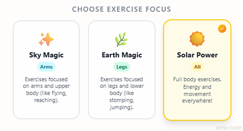
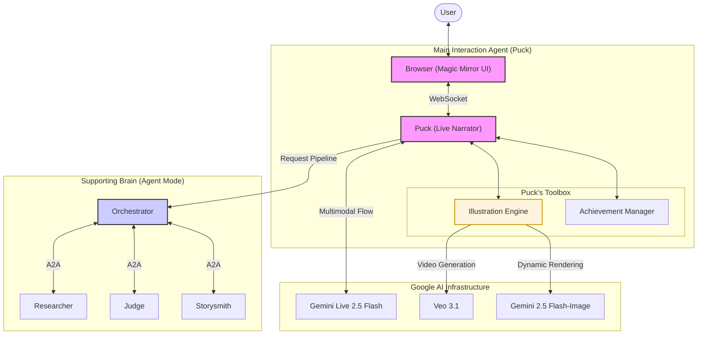
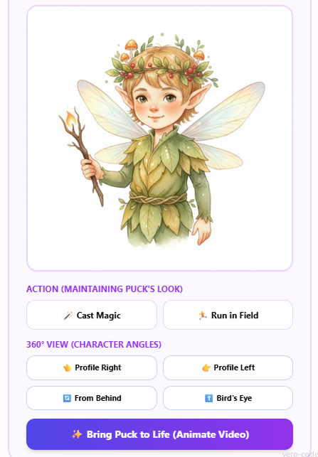

# ✨ Gemini Tales v2: The Evolution

**This is the development repository for Gemini Tales post-hackathon.**

> [!IMPORTANT]
> **Stable Contest Version:** If you are a judge or looking for the original hackathon submission (frozen as of March 16, 2026), please visit the [Original Gemini Tales Repository](https://github.com/vero-code/gemini-tales).


_Turning screen time into active adventure — A magical AI storyteller that sees, hears, and moves with your child. The story that doesn't move until you do._

Gemini Tales is an interactive fairytale book and a **Creative Storyteller ✍️** that **breaks the traditional "text box" paradigm**. It transforms screen time into an active adventure by creating a **seamless** experience where AI doesn't just process text—it sees, hears, and moves with the child.

Built with a premium **React 19 + Vite** frontend, it leverages the **Gemini Live API** for **Interleaved Output** — weaving real-time voice, vision, and watercolor illustrations into a single, **context-aware** stream that makes the magic **feel alive**.

---

## 📍 Quick Navigation

- [📺 Watch in Action](#-watch-in-action)
- [🎭 Dual Storytelling Modes](#-dual-storytelling-modes)
- [🏗️ Project Structure](#-project-structure)
- [🧚 Magic Behind the Scenes](#-magic-behind-the-scenes)
- [🕹️ Interactive Control Center](#-interactive-control-center)
- [🛠️ Tech Stack](#️-tech-stack)
- [🚀 Getting Started (Run & Deploy)](#-getting-started)
- [🧪 Testing & Interactive Guide](#-testing--interactive-guide)
- [👩‍🎓 Hackathon & Build Story](#-hackathon--build-story)

---

## 📺 Watch in Action

Gemini Tales - Early Submission:
[](https://youtu.be/DWHs0eOIf_Q)

Gemini Tales - Newer Demo:
[](https://youtu.be/DCOfdM-uKt0)

---

## 🎭 Dual Storytelling Modes

Gemini Tales offers two distinct ways to experience the magic:

| Feature            | 🎙️ Live Mode (Spontaneous)                                   | 🤖 Agent Mode (Structured)                                   |
| ------------------ | ------------------------------------------------------------ | ------------------------------------------------------------ |
| **Puck's Role**    | **The Improviser**: Composes and narrates purely on the fly. | **The Narrator**: Brings a carefully crafted script to life. |
| **Preparation**    | No wait time. Jump straight into the action.                 | 30-60s "Story Crafting" context formation.                   |
| **Backend Agents** | Idle.                                                        | **Active Background**: Researching and weaving the plot.     |
| **Technology**     | Direct **Gemini Live 2.5 Flash** session.                    | **Orchestrator (3.1 Pro)** + **Live Narrator**.              |
| **Visual Flow**    | Interleaved watercolor illustrations.                        | Themed story-driven scenes.                                  |

> **Note on Agent Mode**: While the background agents (Researcher, Judge, Storysmith) are hard at work forming the perfect context, their direct technical scripts are kept "behind the scenes" to keep the child's interface clean and magical. Look forward to seeing their raw creative process in a future **Gemini Tales Premium** release!

---

## 🤸 Exercise Focus Modes

To ensure children get the exact type of movement they need, Gemini Tales now features **Exercise Focus Modes**. The AI Narrator adapts its physical challenges dynamically based on your selection:

<p align="center">
  
</p>

| Focus              | Mode           | Description                                                                                   |
| ------------------ | -------------- | --------------------------------------------------------------------------------------------- |
| ✨ **Sky Magic**   | **Upper Body** | Exercises focused on arms and upper body (like flying, waving wands, reaching for the stars). |
| 🌿 **Earth Magic** | **Lower Body** | Exercises focused on legs and lower body (like stomping, jumping, running, balancing).        |
| ☀️ **Solar Power** | **Full Body**  | Full body exercises. Energy and movement everywhere!                                          |

---

## 🏗️ Project Structure

- **`frontend/`**: React 19 application using Tailwind CSS and Gemini Live SDK.
- **`backend/app/`**: **Main Agent (Puck)** — the Live Narrator that handles real-time voice, vision, and telling the story.
- **`backend/agents/`**: **Supporting Agents** — background microservices for Researcher, Judge, and Storysmith.
  - **`backend/agents/run_local.ps1`**: Local orchestrator to wake up all supporting agents.

### 🏛️ High-Level Architecture



> 📖 **Deep Dive**: For a detailed look at system design, data flows, and design decisions, see the [**Full Architecture Documentation**](ARCHITECTURE.md).

#### ADK Trace Example

When using **Agent Mode**, the Google Agent Development Kit provides detailed tracing of all agent invocations, timing, and dependencies:

<p align="center">
  
</p>

This trace shows the complete flow: **Puck** → **Orchestrator** → **Researcher** → **Judge** → **Storysmith** → **Content Builder**, with detailed timing for each step.

---

## 🧚 Magic Behind the Scenes

- 🌿 **Cinematic Animation**: **Puck** comes to life with **Veo 3.1**, generating magical video previews that make the world **feel alive**.
- ✌️ **Seamless Interaction**: Real-time visual recognition and **context-aware** response: Stories only begin when Puck sees the "Magic Sign" (two fingers up).
- 📸 **Portrait Transformation**: Upload a photo to see the child transformed into a watercolor fairytale character.
- 🎨 **Visual Consistency**: High-quality scene illustrations are automatically generated by **Gemini 2.5 Flash-Image** as the story unfolds, creating a world that is always aware of the narrative state.
- ⭐ **Achievements & Badges**: Complete physical challenges (like "Hop like a bunny") to unlock magical badges and track your hero's journey in real-time.

---

## 🍌 Nano Banana 2 Enhancements

Upgraded to **[Gemini 3.1 Flash-Image Preview (Nano Banana 2)](https://ai.google.dev/gemini-api/docs/models/gemini)** with three powerful improvements:

### 1. 🎨 High-Fidelity Photo Transformation

Transform any photo into a magical fairytale character while maintaining perfect recognizability.

- **Smart Detail Preservation**: Automatically preserves facial structure, eye color, distinctive features, hair color/style, and natural expression.
- **Quality Guarantee**: Person remains **immediately recognizable** while being stunningly illustrated.
- **How It Works**: Upload a photo → Gemini transforms it into a watercolor fairytale portrait with magical elements while keeping the person's key features intact.
- **Technical**: Multi-turn chat preserves context for consistent character refinement.

### 2. 🔍 Google Search Grounding for Scenes

Scene illustrations now use real-world information for enhanced accuracy and realism.

- **Accurate Locations**: Mention specific places (e.g., "the Amazon rainforest") and Gemini automatically grounds the visual details in real geography.
- **Rich Details**: Accurate plants, animals, landmarks, and environmental features based on actual locations.
- **Magical Realism**: Maintains whimsical fairytale style while depicting real-world accuracy.
- **Technical**: Google Search tool integrated into scene generation chat session for live data fetching.

### 3. 🔄 Character 360° View (Different Poses)

See your character from multiple angles while maintaining perfect consistency.

- **4 Interactive Views**: Profile Right → Profile Left → From Behind → Bird's Eye (three-quarter from above).
- **Perfect Consistency**: Uses multi-turn chat memory to ensure the same character across all poses.
- **Easy to Use**: One-click buttons in the "360° View" section to rotate your character.
- **Technical**: Same `chat_avatar` session maintains character memory across multiple pose generations.

<p align="center">
  
</p>

### Configuration

Model names are now externalized to environment variables for easy customization:

```env
VITE_MODEL_ID_IMAGE=gemini-3.1-flash-image-preview
VIDEO_MODEL_ID=veo-3.1-generate-preview
```

Separate chat sessions optimize image quality:

- **Avatar Session (1:1, 1K resolution)**: Character portraits and poses.
- **Scene Session (16:9, 2K resolution, with Google Search)**: Story illustrations.

---

## 🕹️ Interactive Control Center

The "Magic Mirror" cockpit provides full transparency and control over the AI experience:

- 🔌 **API Lifecycle Management**: One-click connection to the Gemini Pulse with real-time status tracking.
- 🎙️ **Multimodal Inputs**: Live switching between different microphones and cameras to find the best angle for the Magic Sign.
- 💬 **Conversation Hub**: A dual-stream chat system that combines real-time AI transcriptions with manual text input.
- 🔍 **Debug Console**: A dedicated "Technician's View" showing the architectural heartbeat, device sync events, and ADK protocol logs.

---

## 🛠️ Tech Stack

- **Frontend**: React 19, TypeScript, Tailwind CSS.
- **AI Models**:
  - **Gemini Live 2.5 Flash** (Real-time Audio/Vision)
  - **Gemini 3.1 Pro & Flash-Lite** (Agentic Reasoning)
  - **Gemini 3.1 Flash-Image Preview (Nano Banana 2)** (High-fidelity avatars & scenes with Google Search grounding)
  - **Veo 3.1** (Cinematic Video Generation)
- **Backend**: FastAPI, Google ADK, WebSockets.
- **Hosting**: Google Cloud Run, Cloud Artifact Registry.
- **Image Processing**: PIL (Python Imaging Library) for avatar manipulation.
- **Google Cloud Services**: Vertex AI, Google AI API, Generative AI Client Library.

---

## 🚀 Getting Started

### 1. Prerequisites

- Python 3.10+ and `uv` installed.
- Node.js 18+ and `npm`.
- Google Cloud Project with Gemini API access.

### 2. Launch Instructions (Local Development)

To run the full experience locally, start these components in separate terminals:

**A. Start ADK Agents (The Brain)**

```powershell
cd backend/agents
.\run_local.ps1
```

_This starts the sub-agents on ports 8001–8004 required for Agent Mode._

**B. Start Main Agent (Puck)**

```bash
cd backend
uv sync
uv run python app/main.py
```

_Starts Puck, the Live Narrator, ready to see and hear you (Port 8000)._

**C. Start Frontend UI**

```bash
cd frontend
npm install
npm run dev
```

### 3. Cloud Deployment (Google Cloud Run)

To ensure this project is **fully reproducible**, I've included automation scripts that handle the complex deployment of my multi-agent architecture to **Google Cloud Run**.

#### A. Prerequisites for Cloud

- [Google Cloud CLI](https://cloud.google.com/sdk/docs/install) installed and authenticated (`gcloud auth login`).
- An active Google Cloud Project with Billing enabled.
- Your `.env` file in `backend/app/` should contain your `GOOGLE_CLOUD_PROJECT` and `GOOGLE_CLOUD_LOCATION`.

#### B. Deploy Supporting Agents (The Brain)

These agents (Researcher, Judge, Storysmith, Orchestrator) provide the agentic reasoning for the story mode.

```powershell
cd backend/agents
.\deploy.ps1
```

_This script automatically bundles shared logic, configures security, and deploys 4 microservices to Cloud Run._

#### C. Deploy Main App (Puck + Frontend)

This deploys the central "Magic Mirror" interface and the Live Narrator.

```powershell
# Run from the repository root
.\deploy_app.ps1
```

_This script handles the dual-stage build: compiling the React 19 frontend and wrapping it with the FastAPI/Puck bridge into a single production-ready container._

> 💡 **Pro-Tip**: After deployment, you can manage all AI parameters (Model IDs, API Keys) directly through the Cloud Run environment variables without needing to re-deploy.

---

## 🧪 Testing & Interactive Guide

Follow these steps to ensure a magical and stable session:

### 1. The Character Workshop

- **Customize Puck**: Enter a description for your character or upload a photo to create a personalized fairytale avatar.
  - 📸 **Photo Upload**: Transform any photo into a magical fairytale character using **High-Fidelity detail preservation** — the person remains instantly recognizable while becoming beautifully illustrated.
- **Bring Him to Life**: Once Puck is generated, click the **Animate** button to see him start moving! (Powered by **Veo 3.1**).
- **Action Poses**: Generate Puck performing actions ("🪄 Cast Magic", "🏃 Run in Field") to show him in dynamic moments.
- **360° View**: Rotate your character to see him from different angles:
  - **👈 Profile Right** — View from the side looking right
  - **👉 Profile Left** — View from the side looking left
  - **🔄 From Behind** — View from behind looking over shoulder
  - **⬆️ Bird's Eye** — Three-quarter view from above
  - Each pose maintains perfect character consistency using multi-turn chat memory.
- **Choose Your Journey**: Select **Live Mode** for spontaneous play or **Agent Mode** for a structured, multi-agent story.

### 2. Ignition

- **Live Mode**: Click **Connect API** to establish a direct link with Gemini.
- **Agent Mode**: Click **🚀 Generate Story with Agents** to begin the story crafting process.

### 3. Magical Interaction

- **Listen & Act**: Follow the spoken instructions from Puck.
- **Watch the Magic**: As you journey through the tale, Puck will automatically generate beautiful illustrations for every new scene using **Google Search grounding** — real locations and elements are accurately depicted while maintaining a whimsical fairytale style.
- **Earn Badges**: Successfully complete physical tasks to unlock **Achievements** and see your badge collection grow!
- **Voice Response**: Select your **Microphone** and click **Start Audio** to talk to the mirror.
- **Vision Recognition**: Select your **Camera** and click **Start Video** to show your face and the "Magic Sign".
- **Chat Fallback**: If you're in a quiet place, you can also type messages directly into the **Chat Hub**.

### 4. Troubleshooting

- **No Sound/Image?**: Ensure the correct device is selected in the **Microphone** and **Camera** dropdowns before clicking "Start".
- **Connection**: Check the **Debug Console** to verify that the WebSocket status is "Connected".

---

## 👩‍🎓 Hackathon & Build Story

Created for the **[Gemini Live Agent Challenge](https://devpost.com/software/gemini-tales)**.

Check out the full story of how I built an "AI Nanny" to fight the sedentary lifestyle using Google AI and Google Cloud:  
👉 **[Read the Build Story on Dev.to](https://dev.to/vero-code/gemini-tales-how-i-built-an-ai-nanny-to-fight-the-sedentary-lifestyle-5a65)**

---

## 📜 License

MIT — see [LICENSE](LICENSE).

_Created with ❤️ for the next generation of explorers by [Veronika Kashtanova](https://x.com/veron_code)_
